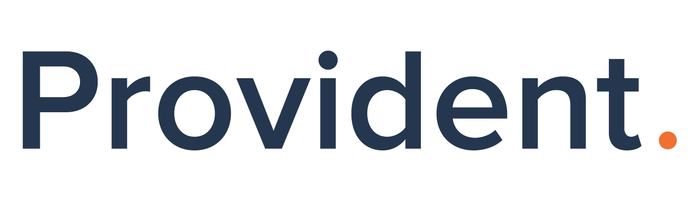

# API Gateway Service

<p align="center">
  
</p>

## Description

This is the API Gateway service for the Provident Applications platform. It serves as the main entry point for all API requests, handling authentication, rate limiting, request routing, and logging. The service is built using the NestJS framework and implements various security and monitoring features.

## Features

- 🔐 Authentication and Authorization (JWT + OAuth2)
- 🛡️ Rate Limiting with PSQL
- 📊 Request Logging with ELK Stack
- 📝 OpenAPI/Swagger Documentation
- 🔄 Request Routing and Load Balancing
- 🚀 High Performance with NestJS
- 🔍 Elasticsearch Integration
- 🗄️ PostgreSQL Database Integration

## Prerequisites

- Node.js (v18 or higher)
- Docker and Docker Compose
- PostgreSQL
- Elasticsearch (for logging)

## Project Setup

1. Install dependencies:
```bash
$ npm install
```

2. Configure environment variables:
Create a `.env` file in the root directory with the necessary environment variables (see `.env.example` for reference).

3. Start the development environment:
```bash
$ docker-compose up -d
```

## Development

```bash
# Start development server
$ npm run start:dev

# Build the project
$ npm run build

# Start production server
$ npm run start:prod

# Run linting
$ npm run lint

# Format code
$ npm run format
```

## Testing

```bash
# Unit tests
$ npm run test

# e2e tests
$ npm run test:e2e

# Test coverage
$ npm run test:cov
```

## API Documentation

The API documentation is available through Swagger UI when running the application:

- Development: http://localhost:3000/api
- Production: https://api.your-domain.com/api

## Logging and Monitoring

The service uses the ELK stack for logging and monitoring. For detailed information about logging configuration and usage, please refer to the [ELK Usage Guide](ELK-USAGE-GUIDE.md).

## Docker Deployment

The service can be deployed using Docker:

```bash
# Build the Docker image
$ docker build -t api-gateway .

# Run the container
$ docker-compose up -d
```

## Project Structure

```
api-gateway/
├── src/                    # Source files
│   ├── auth/              # Authentication module
│   ├── common/            # Common utilities and decorators
│   ├── config/            # Configuration files
│   ├── logging/           # Logging configuration
│   └── main.ts            # Application entry point
├── test/                  # Test files
├── docker-compose.yml     # Docker compose configuration
├── Dockerfile            # Docker configuration
└── openapi.yaml          # OpenAPI specification
```

## Contributing

1. Create a feature branch
2. Make your changes
3. Run tests and ensure they pass
4. Submit a pull request

## License

This project is proprietary and confidential. Unauthorized copying, distribution, or use is strictly prohibited.

<p align="center">
  <a href="http://nestjs.com/" target="blank"></a>
</p>

[circleci-image]: https://img.shields.io/circleci/build/github/nestjs/nest/master?token=abc123def456
[circleci-url]: https://circleci.com/gh/nestjs/nest

  <p align="center">A progressive <a href="http://nodejs.org" target="_blank">Node.js</a> framework for building efficient and scalable server-side applications.</p>
    <p align="center">
<a href="https://www.npmjs.com/~nestjscore" target="_blank"></a>
<a href="https://www.npmjs.com/~nestjscore" target="_blank"></a>
<a href="https://www.npmjs.com/~nestjscore" target="_blank"></a>
<a href="https://circleci.com/gh/nestjs/nest" target="_blank"></a>
<a href="https://discord.gg/G7Qnnhy" target="_blank"></a>
<a href="https://opencollective.com/nest#backer" target="_blank"></a>
<a href="https://opencollective.com/nest#sponsor" target="_blank"></a>
  <a href="https://paypal.me/kamilmysliwiec" target="_blank"></a>
    <a href="https://opencollective.com/nest#sponsor"  target="_blank"></a>
  <a href="https://twitter.com/nestframework" target="_blank"></a>
</p>
  <!--[](https://opencollective.com/nest#backer)
  [](https://opencollective.com/nest#sponsor)-->

## Support

Nest is an MIT-licensed open source project. It can grow thanks to the sponsors and support by the amazing backers. If you'd like to join them, please [read more here](https://docs.nestjs.com/support).

## Stay in touch

- Author - [Kamil Myśliwiec](https://twitter.com/kammysliwiec)
- Website - [https://nestjs.com](https://nestjs.com/)
- Twitter - [@nestframework](https://twitter.com/nestframework)

## License

Nest is [MIT licensed](https://github.com/nestjs/nest/blob/master/LICENSE).
